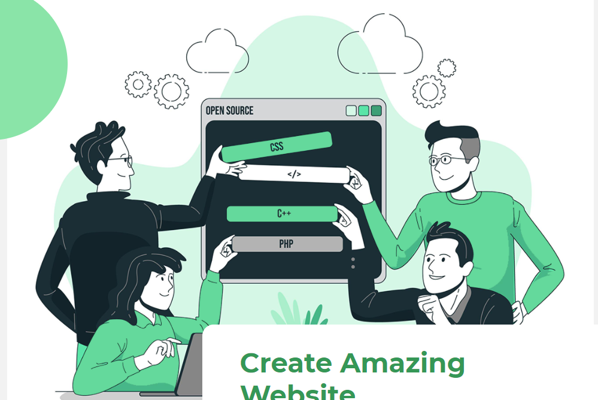

# Hi there 🙌🏽 I'm Saipranay Alishetty - aka PranxXxD

     

## I'm a <Frontend-Dev 💻/>

🚀 Breif of me I'm a avid frontEnd developer with minimal skills and eager to develop and contribute to the community, can ready to collab and contribute to open source. need some mentoring who can guide me to the proper way in devleoping world...

BackEnd.................Loading!

👨🏽‍💻 I'm Self taught developer

                                                                                   
* Exploring JavaScript
* Tweets | Linkedin post | Discord community
* 2022 Goal #1: Gain skills and try to implement on the real time projects and host it.
* 2022 Goal #2: Learn UI/UX for web designing and try to develop some Aesthetic UI/UX components   

# ✨ My Work 

    

## 🛠 Skills - Technologies

            

## Current Update

Currently working on the E-commerce website.
which is streetWear.com, streetWear is an minimal and aesthetic website
developed by using nextjs framework of react, the web-site sell clothing products for both men & women 
with affordable price with good quality, one can easily place an order without login or creating an account. 
User can also check if the product is deliverable to his/her address which makes the user experiance better!

Technologies used HTML CSS JavaScript nextjs => reactjs => next.js framework, Tailwind,
CSS, MongoDb, AWS bucket, for storing images, JWT => for generating a token, 
Crypto-js => user authentication, 
emailjs => email authentication 
material ui & react-icons 

"Public commits, One can make commits to this repo as i'm still working on it and ready to collab and scale the website"!

## Project Screenshots

* Signup Page & SignIn Page

   

* Password Reset Page & Home Page

    

* Products Page & Product Page(Out of Stock,In Stock)

   

* My orders & Out of Stock Products

  

* CheckOut Page & Payment Page

  

